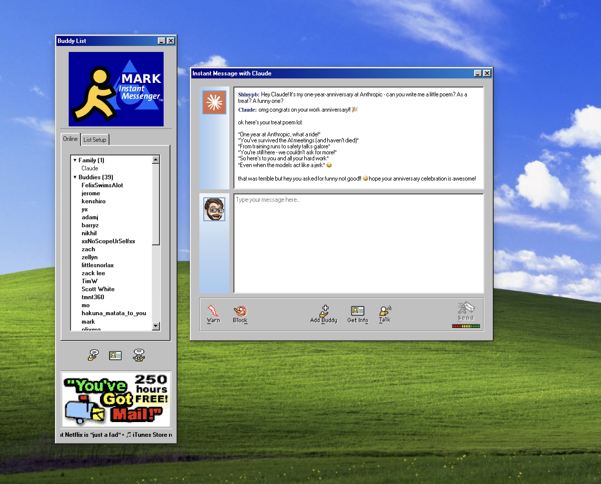

# Mark Instant Messenger

A nostalgic recreation of AOL Instant Messenger (AIM) built with Electron, React, and TypeScript made for my friend's @shinypb's work anniversary. 

Mostly vibe-coded, don't use this for... anything.

 

## Setup

1. Install dependencies:
```bash
npm install
```

2. Run the application:
```bash
npm start
```

## Claude Integration

To chat with Claude:
1. Click on "Claude" in the Family group
2. Enter your Anthropic API key when prompted
3. Start chatting!

Your API key is securely stored using Electron's safeStorage API.

## Development

- `npm start` - Start the Electron app in development mode
- `npm run make` - Build the application for distribution
- `npm run lint` - Run ESLint

